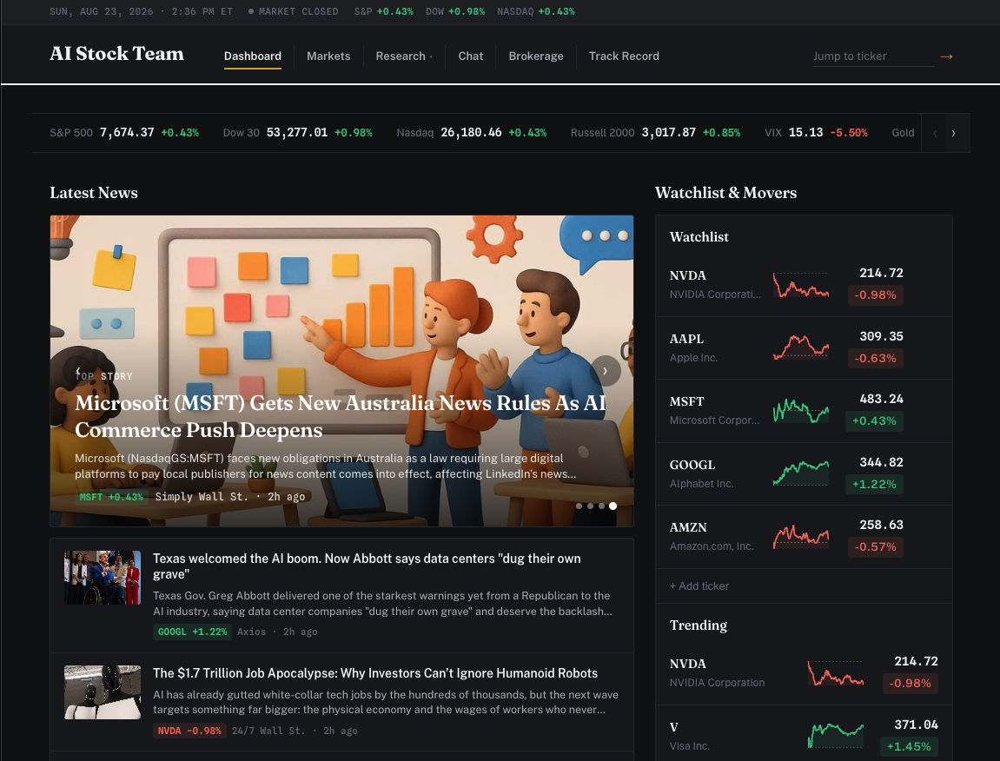
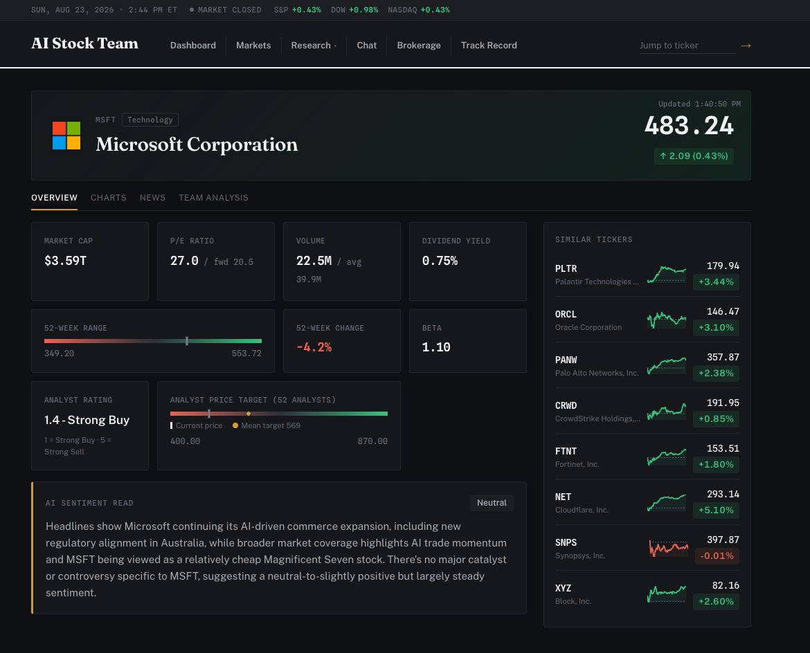
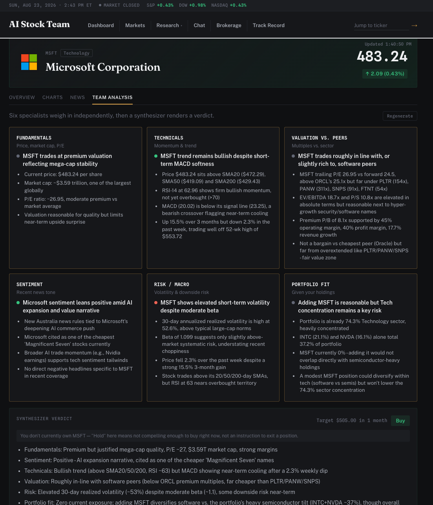

# AI Stock Team

An AI-powered stock research app built with [pydantic-ai](https://ai.pydantic.dev/) and [yfinance](https://github.com/ranaroussi/yfinance), running on Claude via AWS Bedrock. It ships as a one-shot CLI, a FastAPI backend, and a React web app.

| Dashboard | Ticker Detail | Stock Team Analysis |
|---|---|---|
|  |  |  |

## Table of contents

- [What's here](#whats-here)
- [Tech stack](#tech-stack)
- [Setup](#setup)
  - [Configuring the AI model](#configuring-the-ai-model)
  - [Connecting SnapTrade](#connecting-snaptrade)
- [Running it](#running-it)
  - [A note on yfinance rate limiting](#a-note-on-yfinance-rate-limiting)
- [Tour of the web app](#tour-of-the-web-app)
- [Tests](#tests)
- [Project layout](#project-layout)
- [License](#license)

## What's here

- **CLI** — point it at a ticker, get a structured snapshot: price, market cap, P/E, sentiment, and a short summary.
- **Web app** — a dashboard with an editable watchlist, market screens (stocks/options/private companies), a per-ticker detail page with an interactive price chart, a multi-agent buy/hold/sell verdict page, a Buy Scan that runs that same verdict engine over today's market movers to surface new ideas, a Themes tab showing each curated theme's shared, periodically-refreshed model allocation sized to whatever amount you type in — with an LLM-scored, SEC-filings-derived ticker universe as an alternative to a hand-picked list, and an opt-in "Update theme" flow when a refresh finds a better one, a Track Record page scoring past AI verdicts against reality, a research chat with a live per-ticker canvas, follow-up suggestions, and side-by-side comparison, and a read-only brokerage page (via SnapTrade) with live positions/orders and news for what you actually hold.
- **Backend API** — FastAPI + Server-Sent Events, streaming quotes, sentiment, and agent tool calls live to the frontend.

## Tech stack

| | |
|---|---|
| Agents | [pydantic-ai](https://ai.pydantic.dev/) on AWS Bedrock (Claude) |
| Data | [yfinance](https://github.com/ranaroussi/yfinance) |
| Brokerage linking | [SnapTrade](https://snaptrade.com/) |
| Backend | FastAPI, Uvicorn, Server-Sent Events |
| Frontend | React 19, React Router, Vite |
| Tests | pytest + pytest-asyncio |

Requires Python 3.12+ and [uv](https://docs.astral.sh/uv/).

## Setup

This project calls Claude through AWS Bedrock, so you'll need AWS credentials with Bedrock access available in your shell (`AWS_ACCESS_KEY_ID`/`AWS_SECRET_ACCESS_KEY`/`AWS_SESSION_TOKEN`, or an equivalent bearer token setup). Region and model are configured in `src/core/config.yaml`.

```bash
uv sync --group main --group dev
```

(Or `make install`, which also runs `npm install` in `webapp/` for you.)

Copy `.env.example` to `.env` and fill in whichever sections you need. The
brokerage page needs a `SNAPTRADE_CLIENT_ID`/`SNAPTRADE_CONSUMER_KEY` pair
from your [SnapTrade dashboard](https://snaptrade.com/) — everything else in
the app works without it.

### Configuring the AI model

All agents (CLI, chat, stock team, Daily Digest) run on Claude via AWS
Bedrock, built centrally by `src/core/config.py` from `src/core/config.yaml`
— there's no separate key/model config per agent.

1. **AI keys** — get AWS credentials with Bedrock access (and access to
   whichever model you pick, granted per-region in the Bedrock console).
   Either export them in your shell:
   ```
   AWS_ACCESS_KEY_ID=
   AWS_SECRET_ACCESS_KEY=
   AWS_SESSION_TOKEN=
   ```
   or put them in `.env` — `core/env.py` loads it before anything reads
   `os.environ`, and `load_dotenv()` never overrides a variable already set
   in your real shell, so this is safe to add alongside existing AWS
   SSO/shared-credentials-file setups. If you're already logged in via
   `aws sso login` or similar, you can skip this — the app will pick up
   your ambient credentials.
2. **Model/region** — edit the `model:` and `provider:` sections of
   `src/core/config.yaml`:
   ```yaml
   provider:
     region_name: us-east-2   # must be a region where you have Bedrock access

   model:
     name: global.anthropic.claude-sonnet-5   # any Bedrock-hosted model ID
   ```
3. **Generation behavior** (optional) — `model_settings:` in the same file
   controls things like `max_tokens`, `temperature`, and `timeout`; see the
   comments in `config.yaml` for what each does and why a couple are
   commented out by default (e.g. `temperature` is rejected by
   `claude-sonnet-5` on Bedrock).

No code changes or restarts of anything but the backend are needed to swap
models — just edit `config.yaml` and restart `make backend`.

### Connecting SnapTrade

1. Sign up for a [SnapTrade](https://snaptrade.com/) developer account and
   create an app. On its API keys page, grab the **Client ID** and generate
   a **Personal API key** (its secret is the consumer key) — this app uses
   that single-identity Personal API key model, not SnapTrade's
   multi-tenant `registerUser`/`userId`/`userSecret` flow, so there's no
   per-app-user provisioning step.
2. Put those two values in `.env`:
   ```
   SNAPTRADE_CLIENT_ID=
   SNAPTRADE_CONSUMER_KEY=
   ```
3. Restart the backend, then open `/brokerage` in the web app and click
   **Connect a brokerage**. That opens SnapTrade's hosted Connection
   Portal — an OAuth-style flow where you pick your brokerage and log in
   directly with them; credentials never pass through this app.
4. Once you complete the flow you're redirected back and the connection
   shows up as a card with live positions, orders, and news.

The connection is deliberately read-only end-to-end: the portal is always
requested with `connection_type="read"` (see
`src/core/snaptrade_client.py`), and no trade-execution SDK calls are wired
up anywhere in the app, so there's no code path that could place a trade.
Positions/balances are fetched live on every page load and never persisted
— only which brokerage/account you've connected is stored.

The app has user accounts backed by a local SQLite DB. Set up the schema:

```bash
uv run alembic upgrade head
```

By default (`AUTH_REQUIRED=false`, or just unset) the brokerage page skips
login entirely — requests are transparently attributed to a single local
user, since a fork-and-run instance only ever has one person using it.
Login/signup only matter if you're hosting one instance for more than one
person; set `AUTH_REQUIRED=true` in `.env` to turn them back on, then seed a
standard admin account for testing:

```bash
uv run python -m core.seed_admin   # creates admin@example.com, prints/writes its password to .admin_credentials
```

`.admin_credentials` is gitignored — read it locally to get the admin
password; rerunning `seed_admin` is a no-op if the account already exists.

## Running it

**CLI** — one-shot snapshot for a ticker:

```bash
uv run ai-stock-team NVDA
```

**Backend API** (serves the web app at `http://localhost:8000`):

```bash
make backend
```

**Frontend** (in a separate terminal):

```bash
make frontend
```

Or run both at once with `make dev` (Ctrl-C stops both). The Vite dev
server proxies `/api` to the backend, so run both together while
developing. Once both are up, open `http://localhost:5173`.

### A note on yfinance rate limiting

Every price/fundamentals lookup in this app goes through
[yfinance](https://github.com/ranaroussi/yfinance), which scrapes Yahoo
Finance's internal web endpoints rather than calling an official,
key-authenticated API. There's no published rate limit and no SLA - under
enough sustained traffic (e.g. loading the Themes tab, which pulls
price/EPS/volatility data across the whole catalog's tickers) Yahoo will
start rejecting requests, in a couple of different ways:

- **`Too Many Requests. Rate limited.`** - a plain rate limit. Usually
  clears on its own within a few minutes.
- **`Invalid Crumb`** - Yahoo revoked the session token yfinance uses
  internally. Once this starts, every subsequent call fails until yfinance
  gets a fresh one - which in practice means **restarting the backend
  process** (`make backend`/`make dev` again), not just waiting.
- **`User is unable to access this feature`** - a harder block, one level
  up from a plain rate limit. Same fix: restart, then back off for a bit.

None of these crash the app - every yfinance call site either falls back to
`null`/omits that item, or (for the handful of direct `.history()`/`.info`
calls) retries a couple of times with backoff first (`with_yf_retries` in
`src/core/tools.py`). You'll just see blank cells/missing data on whatever
got rate-limited until it clears. If you're iterating on backend code with
`--reload`, note that every file save restarts the process and wipes all
the in-memory caches (`core/tools.py`'s `_info_cache`, `core/themes.py`'s
`_universe_cache`, `agents/theme_builder.py`'s `_summary_cache`), so heavy
editing sessions will hit this more than normal usage does.

## Tour of the web app

**Dashboard (`/`)** — the landing page. A horizontally-scrolling strip of
major indices/commodities (S&P 500, Nasdaq, Dow, VIX, Gold, Bitcoin, Crude
Oil) up top, then a news section: a featured-story carousel, a plain list of
the rest of your watchlist's headlines, three category columns (Top
Stories, Markets & Economy, Tech & AI), and a More News overflow section for
everything else. Articles are picked by editorial quality (Yahoo's editors'
pick flag and thumbnail presence) rather than pure recency, and each is
tagged with a "TICKER +1.23%" day-change badge where a source ticker is
known. This ranking (shared by every news surface in the app — Dashboard,
Ticker Detail, Brokerage) also collapses syndicated wire stories that show
up under more than one ticker's feed into a single entry (crediting every
matching ticker instead of showing duplicates), drops articles older than a
week once there's enough fresh material to fill the feed, and down-ranks
publishers found to be essentially unreadable past the headline (aggressive
paywalls, or broken article links) — see
`scripts/news_scrape_coverage.py` for the scrape-coverage check behind that
list. Alongside that, a watchlist card with live prices, day-change badges,
and sparklines — add a ticker with the input at the bottom (it's validated
against a real quote before it's added — a typo gets rejected inline) and
remove one by hovering a row and clicking the ×. Below that, market-mover
panels — Trending, Most Active, Top Gainers, Top Losers — each linking
through to a full paginated screen.

**Ticker Detail (`/tickers/AAPL`)** — click any ticker anywhere in the app to
land here. Streams in a price/market-cap/P/E header, an AI-generated
bullish/bearish/neutral sentiment badge with a short written summary, recent
headlines, and an interactive price chart (1D/5D/1mo/6mo/1y, line or
candlestick, with an optional SPY overlay for comparison) — choices persist
across visits.

**Stock Team Analysis (`/tickers/AAPL/team`)** — a multi-agent buy/hold/sell
verdict. A fundamentals specialist and a sentiment specialist each stream in
their own analysis card, then a synthesizer agent weighs both into a final
verdict with reasoning — so you see the "why" instead of just an answer.

**Buy Scan (`/scan`)** — runs the full Stock Team multi-agent verdict over
today's most-active, top-gaining, top-losing, trending, and best-historical
tickers (deduped, capped at 20) instead of just your own watchlist, so you
can discover buy ideas outside what you already hold. Streams each verdict
in live as it's produced, has a "Buy only" filter, and reuses a ticker's
already-logged verdict for the day instead of re-running the full pipeline
if you scan again.

**Themes (`/themes`)** — pick a curated investment theme (AI & Machine
Learning, Semiconductors, Cybersecurity, Clean Energy & EVs, and more) and
type a dollar amount to see it sized. Each theme has one shared, model
allocation that every visitor sees — the same tickers and weights for
everyone, refreshed on a schedule rather than rebuilt per click, so typing
a different amount just rescales `dollar_amount`/`shares` client-side
instead of re-running anything. Weighting is a 3-month momentum +
market-cap composite, computed and clamped in Python rather than trusted
from an LLM, so the live page itself makes no LLM calls at all.

A theme's ticker universe comes from one of three sources: a live
yfinance industry screen (for themes that map cleanly to one industry), a
curated seed list (for themes spanning several), or — for AI & Machine
Learning so far — SEC EDGAR full-text search matched against theme
keywords, with an LLM scoring each matched filer's actual relevance (0–1,
with a one-line rationale) rather than trusting a keyword hit alone; every
scoring call is logged with its real per-call cost (`llm_call_log`,
`call_site="theme_filings_scorer"`) so a refresh's total spend is known,
not estimated (~$0.10–0.25 per theme per run, depending on how many
candidates clear the market-cap floor). Every ticker is filtered to one
with a live, fetchable price before it's included.

Refreshing a theme (`uv run python -m agents.refresh_themes`, all themes
in one pass) never overwrites what's live — it writes a pending
*candidate* instead, and the Themes tab surfaces it as an "updated
version available" banner with an explicit diff (tickers added/dropped,
weight changes) plus a selection-quality delta, letting you click
"Update theme" to promote it. Promoting re-stamps each ticker's buy price
at that moment, so a theme's shared "since buy" return always tracks
from when a version actually went live, not from whenever the ranking
job happened to run.

**Refresh cadence** (not yet wired to a scheduler - run manually or via
your own cron/launchd for now): plain `agents.refresh_themes` (pure
market-data ranking, no LLM call) is cheap enough to run **weekly** — any
more often and momentum-driven reweights barely move. Adding `--filings`
(also re-scores filings-sourced themes' universe via the LLM, roughly
$0.10–0.25/theme) should only run **monthly**, since 10-Ks file at most
quarterly and re-scoring the same filings more often just burns money for
no new signal.

**Research Chat (`/chat`)** — open-ended Q&A about any stock, backed by a
tool-using agent (price, market cap, P/E, day change, history, news,
watchlist lookups) with your watchlist and today's date in its system
prompt. A few things that go beyond a typical chatbot:
- **Research canvas** — every ticker you mention builds a live card on the
  right (price, day change, market cap, P/E, a real price-history
  sparkline), accumulating across the whole conversation instead of
  scrolling out of view. Ask about a ticker three different ways and it's
  still one card, filling in.
- **Compare** — check the "Compare" box on 2+ cards to get an aligned
  side-by-side stat table.
- **Suggested follow-ups** — quick-action chips for the obvious next
  questions (market cap, a different history window, recent news) based on
  what a card doesn't have yet.
- The conversation and canvas survive navigating away and even a page
  refresh (persisted to `localStorage`) — click a card to jump into Ticker
  Detail, then come back and the chat is still there.

**Brokerage (`/brokerage`)** — connect a real brokerage account (via
SnapTrade's OAuth-style link flow) and see live positions, orders, and news
for what you actually hold. Read-only: positions/balances are fetched live
on every load and never persisted, only which brokerage/account you've
connected is. A few things worth knowing:
- **Multiple accounts** — each connected brokerage shows as a card (name,
  logo, connection status, a × to disconnect); an account picker switches
  the Positions/Orders/News tabs between "All accounts" (combined) and any
  one account individually.
- **Positions tab** — table or heatmap (treemap sized by market value,
  colored by today's % change) view, plus an After Hours toggle that swaps
  in extended-hours price/change once the market's closed.
- **Orders tab** — recent account activity (trades, dividends, transfers)
  with a signed amount column.
- **News tab** — pulls headlines scoped to whichever positions are in view
  (deduped, capped at 40 symbols so the query stays bounded for large
  portfolios) through the same ranked/deduped news pipeline the Dashboard
  uses.
- **Daily Digest tab** — an AI-written article on how your portfolio
  performed today and why, plus what to watch next. Generated on demand
  (never automatically) since it's a real Bedrock call; claims in the
  article and its key drivers/watch items are inline-cited back to the news
  they're grounded in, with a Sources list at the bottom linking to the
  original articles.
- Prices auto-refresh every 30s while the tab is visible, with a "last
  updated" timestamp next to the total.

**Track Record (`/track-record`)** — scores every past Stock Team verdict
against what actually happened, using real historical prices at the
verdict's own 1-week/1-month/3-month horizon, and rolls that up into
overall hit-rate stats plus a per-specialist breakdown (e.g. "Fundamentals:
68% · 14 calls") — so you can see which specialist's calls to trust more,
not just the final aggregate verdict.

**Markets (`/markets/...`)** — paginated screens for stocks (most-active,
gainers, losers, top-performing, trending, best-historical, top ETFs),
options (most-active, highest open interest), and private companies
(highest-valuation), reachable from the Dashboard's mover panels or the nav
bar.

## Tests

```bash
make test            # both, or run individually:
uv run pytest         # backend
cd webapp && npm test # frontend (Vitest)
```

## Project layout

```
src/
  agents/     # CLI entrypoint, chat agent, multi-agent stock team
  core/       # shared agent config, tools, FastAPI app, SSE helpers
webapp/       # React + Vite frontend
tests/        # pytest suite
scripts/      # one-off diagnostics, e.g. news_scrape_coverage.py
```

## License

[MIT](LICENSE)
